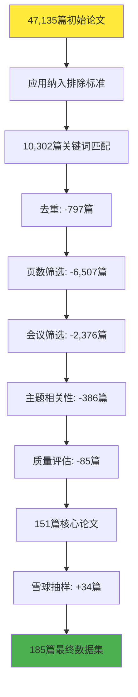

# Large Language Models for Cyber Security
## 网络安全领域中大语言模型应用的系统性文献综述

  
    汇报人：[您的姓名] <carbon:arrow-right class="inline"/>
  

---
transition: fade-out
---

# 目录

<Toc maxDepth="1"></Toc>

---
layout: default
---

# 论文基本信息

## 作者信息
- **第一作者**: HANXIANG XU (华中科技大学)
- **通讯作者**: KAILONG WANG, KAI CHEN, HAOYU WANG
- **合作机构**: 
  - 华中科技大学 (中国)
  - 哈马德·本·哈利法大学 (卡塔尔)
  - 南洋理工大学 (新加坡)

## 发表信息
- **发表时间**: 2025年5月15日
- **论文类型**: 系统性文献综述 (SLR)
- **预印本**: arXiv:2405.04760v4

## 研究规模
- **搜索论文总数**: 47,135篇
- **最终分析论文**: 185篇
- **时间跨度**: 2019-2025年
- **涵盖顶级会议期刊**: 12个安全和软工领域顶会

## 核心贡献
- 首个全面的LLM4Security系统性综述
- 四个关键研究问题的深入分析
- 完整的方法论和未来研究方向

---
layout: image-right
image: https://source.unsplash.com/800x600/?research,methodology
---

# 研究动机与背景

## 为什么需要这项研究？

<v-clicks>

- **LLM技术飞速发展**: 从GPT-2到GPT-4，参数规模和能力显著提升

- **网络安全挑战日益严峻**: 
  - 威胁数量和复杂性持续增长
  - 传统安全方法效率不足
  - 需要智能化自动化解决方案

- **现有综述局限性**:
  - 研究范围相对狭窄
  - 缺乏对数据、技术、模型的系统分析
  - 未能提供全面的应用图景

- **学术界迫切需求**: 
  - 理解LLM在安全领域的应用现状
  - 识别关键挑战和机遇
  - 指导未来研究方向

</v-clicks>

---
layout: default
---

# 研究方法论 - 系统性文献综述

## 1. 规划阶段 (Planning)
- **需求识别**: 确定SLR的必要性
- **研究问题制定**: 4个核心RQ
- **协议定义**: 搜索策略和质量评估标准
- **纳入排除标准**: 明确筛选规则

## 2. 执行阶段 (Conducting)
- **搜索策略**: 手动+自动搜索
- **研究筛选**: 标题摘要→全文评估
- **质量评估**: 5项质量标准
- **雪球抽样**: 前向后向引用追踪

## 3. 报告阶段 (Reporting)
- **数据提取**: 系统化信息收集
- **统计分析**: 论文分布趋势
- **问题回答**: RQ1-RQ4深度分析
- **威胁评估**: 有效性威胁分析

---

## 搜索策略细节

### Quasi-Gold Standard (QGS) 方法
1. **识别相关会议期刊**: 6个顶级安全会议 + 6个软工会议
2. **建立QGS**: 手动筛选118篇相关论文
3. **关键词提取**: 通过词频分析确定搜索词
4. **自动搜索**: 7个主要数据库检索

### 搜索关键词
- **LLM相关**: Large Language Model, GPT-*, ChatGPT, T5, AIGC...
- **安全相关**: Cyber Security, Vulnerability Detection, Malware Analysis...

### 数据库搜索结果
| 数据库 | 论文数量 |
|--------|---------|
| Springer | 23,986 |
| arXiv | 6,346 |
| ACM Digital Library | 5,595 |
| Web of Science | 5,516 |
| IEEE Xplore | 3,745 |
| Science Direct | 1,242 |
| Wiley | 705 |
| **总计** | **47,135** |

---
layout: default
---

# 筛选过程与最终数据集

## 质量评估标准 (QAC)
- **QAC#1**: 研究目标和问题的清晰性和适当性
- **QAC#2**: 方法论和研究设计的充分性  
- **QAC#3**: 数据收集和分析过程的严谨性
- **QAC#4**: 结果和结论的有效性
- **QAC#5**: 报告和文档的完整性

*每项标准0-2分，总分≥6分的论文被纳入*

---
layout: two-cols
---

# 论文分布统计

## 会议期刊分布
- **ISSTA**: 10% (18篇)
- **ICSE**: 8% (15篇) 
- **ASE**: 7% (13篇)
- **arXiv**: 25% (46篇)
- **其他顶会**: 50%

## 时间分布趋势
| 年份 | 论文数量 |
|------|---------|
| 2020 | 1 |
| 2021 | 2 |
| 2022 | 11 |
| 2023 | 82 |
| 2024 | 83 |
| 2025 | 6 |

::right::

## 增长趋势分析

**爆发式增长**: 2023-2024年研究激增

- 2022年: ChatGPT发布
- 2023年: 研究数量增长7倍
- 2024年: 持续高产出

**arXiv占比高**: 反映了该领域的快速发展和研究的前沿性

**顶会认可**: ISSTA、ICSE等顶级会议的高接收率证明了研究质量

---
layout: center
class: text-center
---

# 四个核心研究问题

## RQ1: 任务类型
**LLM在哪些安全任务中得到应用？**

识别和分类LLM在网络安全领域的具体应用场景

## RQ2: 模型选择  
**采用了哪些LLM来支持安全任务？**

分析不同LLM架构的特点和适用性

## RQ3: 领域技术
**使用了哪些领域特定技术？**

探索适配LLM到安全任务的方法和技术

## RQ4: 数据处理
**数据收集和预处理有何差异？**

分析不同安全任务中的数据特点和处理方法

---
layout: default
---

# RQ1: LLM支持的安全任务类型

## 六大安全领域分布

### 软件系统安全
**63%** (119篇)
- 漏洞检测 (22)
- 漏洞修复 (15) 
- 程序模糊测试 (11)
- Bug检测修复 (43)
- 逆向工程 (10)
- 恶意软件检测 (3)

### 网络安全  
**14%** (26篇)
- 流量入侵检测 (10)
- Web模糊测试 (3)
- 网络威胁分析 (5)
- 渗透测试 (4)
- 协议分析 (1)

### 信息内容安全
**12%** (20篇)
- 钓鱼诈骗检测 (8)
- 有害内容检测 (8)
- 隐写分析 (2)
- 访问控制 (1)

### 硬件安全
**5%** (9篇)
- 硬件漏洞检测 (2)
- 硬件漏洞修复 (5)
- IP保护 (1)

### 区块链安全
**6%** (11篇)  
- 智能合约漏洞检测 (10)
- 交易异常检测 (1)

---
layout: default
---

# 软件系统安全 - 主要应用场景

## 漏洞检测与修复
### 漏洞检测 (22篇)
- **静态分析**: 代码语义理解
- **多任务学习**: VulLLM同时检测、定位、解释
- **图神经网络结合**: SCALE生成注释树
- **二进制分析**: LATTE自动化污点分析

### 漏洞修复 (15篇)  
- **T5架构优势**: 编码器-解码器结构
- **上下文感知**: 考虑代码功能完整性
- **多语言支持**: Java, JavaScript等
- **自然语言建议**: VulAdvisor生成修复建议

## 程序调试与模糊测试
### Bug检测修复 (43篇)
- **对比学习**: 关注正确与错误代码差异
- **静态分析结合**: 精确定位Bug位置
- **交互式修复**: ChatGPT迭代反馈

### 程序模糊测试 (11篇)
- **测试用例生成**: 从历史Bug报告学习
- **覆盖率引导**: CovRL强化学习优化
- **文档分析**: ProphetFuzz预测风险组合

### 逆向工程 (10篇)
- **变量名恢复**: 多轮查询传播结果
- **反汇编**: 结合类型推理引擎
- **代码可读性**: 增强反编译器输出

---
layout: default
---

# 网络安全应用详解

## Web安全与渗透测试

### Web模糊测试 (3篇)
- **GPTFuzzer**: 强化学习生成WAF绕过载荷
- **SQL注入检测**: 编码器-解码器架构
- **协议模糊测试**: CHATAFL处理网络协议

### 渗透测试 (4篇)
- **PentestGPT**: 自动化渗透测试框架
- **信息收集**: IP地址、域名、技术栈分析  
- **权限提升**: Linux特权升级指导
- **载荷生成**: 更复杂的攻击代码

## 流量分析与威胁情报

### 流量入侵检测 (10篇)
- **多场景应用**: Web应用、IoT、车载网络
- **异常行为捕获**: 用户行为模式分析
- **攻击意图描述**: 自然语言解释入侵行为
- **安全建议**: 针对性防护策略推荐

### 网络威胁分析 (5篇)
- **CTI生成**: 从网络安全文本提取威胁情报
- **结构化报告**: 非结构化信息标准化
- **优先级评估**: CVEDrill威胁影响预测
- **决策支持**: 自动化响应决策

---
layout: default
---

# RQ2: 采用的LLM模型架构

## 三种主要架构分类

### 编码器架构 (Encoder-only)
**代表模型**: BERT, RoBERTa, CodeBERT

**特点**:
- 专注理解和编码
- 生成上下文嵌入
- 适合分类任务

**应用**:
- 漏洞检测
- 恶意软件分类  
- 系统日志分析

**论文数量**: 35篇提及BERT

### 编码器-解码器 (Encoder-Decoder)
**代表模型**: T5, BART, CodeT5

**特点**:
- 序列到序列任务
- 结构化输入输出
- 双模态处理能力

**应用**:
- 漏洞修复 (T5优势明显)
- 代码生成
- 程序模糊测试

**优势**: 在修复任务中表现突出

### 解码器架构 (Decoder-only)  
**代表模型**: GPT系列, LLaMA, CodeLLaMA

**特点**:
- 自回归生成
- 强大的few-shot能力
- 大上下文窗口

**应用**:
- 几乎所有安全任务
- 复杂推理分析
- 代码生成修复

**主导地位**: GPT-3.5/4使用最频繁

---
layout: default
---

# LLM架构使用趋势分析

## 时间演进趋势

### 2020-2021年: 起步阶段
- 编码器-解码器架构为主
- 研究数量有限 (1-2篇)
- 探索性应用

### 2022年: 多样化发展  
- 三种架构并存
- 编码器架构: 45%
- 解码器架构: 36%
- 编码器-解码器: 18%

### 2023-2024年: 解码器主导
- **2023年**: 解码器架构占69%
- **2024年**: 解码器架构占73%
- ChatGPT等模型影响显著

## 社区认可度对比

### HuggingFace统计
**下载量Top20**:
- 编码器架构: 13/20
- BERT及其变体为主

**点赞量Top20**:
- 解码器架构: 16/20  
- 社区更偏好生成式模型

### 架构优势分析
**解码器优势**:
- 强大的生成能力
- Few-shot学习
- 大上下文处理

**挑战**:
- 参数规模巨大
- 计算资源需求高
- 部署成本上升

---
layout: default
---

# 主要LLM模型统计

## 使用频率排名

### 闭源模型
| 模型 | 论文数量 | 架构 |
|------|---------|------|
| **GPT-3.5** | 78 | Decoder |
| **GPT-4** | 64 | Decoder |
| **Codex** | 14 | Decoder |
| **Bard** | 13 | Decoder |
| **Claude** | 5 | Decoder |

### 开源模型  
| 模型 | 论文数量 | 架构 |
|------|---------|------|
| **RoBERTa** | 14 | Encoder |
| **CodeT5** | 14 | Enc-Dec |
| **CodeBERT** | 12 | Encoder |
| **CodeLLaMA** | 10 | Decoder |
| **GPT-2** | 9 | Decoder |

## 架构特点与应用场景

### 编码器架构特色
- **CodeBERT**: 双模态代码理解
- **GraphCodeBERT**: 数据流感知
- **SecureBERT**: 专门的网络安全模型
- **HS-BERT**: 硬件安全文档分析

### 编码器-解码器优势
- **T5**: 漏洞修复任务最佳
- **CodeT5**: 代码理解生成平衡
- **PLBART**: 程序语言BART变体

### 解码器架构主导原因
- **通用性强**: 适用所有安全任务
- **少样本学习**: 快速适应新任务  
- **推理能力**: 复杂逻辑分析
- **上下文理解**: 大规模信息处理

---
layout: default
---

# RQ3: 领域特定适配技术

## 三大类适配方法

### 提示工程 (Prompt Engineering)
**使用率**: 几乎100%的论文

**技术类型**:
- **Zero-shot**: 直接任务执行
- **Few-shot**: 少量示例学习
- **Chain-of-Thought**: 步骤推理
- **特定领域提示**: 安全知识注入

**应用场景**:
- 网络威胁分析
- 渗透测试指导
- 漏洞检测分类

### 微调技术 (Fine-tuning)
**使用率**: 31%的论文 (57/185)

**微调策略**:
- **全参数微调**: 最大适应性
- **PEFT**: 参数高效微调
- **LoRA**: 低秩适应
- **强化学习**: 任务导向优化

**领域分布**:
- 信息内容安全: 50%
- 软件系统安全: 36%
- 网络安全: 15%

### 外部增强 (External Augmentation)  
**使用率**: 36%的论文

**增强技术**:
- 特征增强
- 外部检索
- 工具集成
- 模型交互
- 工作流集成

**价值**: 解决幻觉和假阳性问题

---
layout: default
---

# 微调技术深度分析

## 微调策略分类

### 全参数微调
**适用场景**: 
- 任务差异度大
- 资源充足环境
- 最佳性能要求

**应用案例**:
- VulRepair: T5漏洞修复
- RealVul: PHP漏洞检测
- Bug修复数据集训练

### 参数高效微调 (PEFT)
**技术方法**:
- **Adapter-tuning**: 插入可训练适配器
- **Prompt-tuning**: 优化提示参数
- **LoRA**: 低秩矩阵分解

**优势**: 降低计算成本，保持效果

## 强化学习策略

### 应用场景
- **Web安全**: GPTFuzzer生成绕过载荷
- **日志分析**: 基于准确性奖励优化
- **程序修复**: RePair执行结果奖励
- **模糊测试**: CovRL覆盖率引导

### 挑战与限制
**数据质量问题**:
- 标注数据稀缺
- 数据不平衡
- 环境特异性

**性能限制**:
- 过拟合风险
- 灾难性遗忘
- 安全对齐丢失

**资源需求**:
- 计算成本高
- 时间开销大

---
layout: default
---

# 外部增强技术详解

## 八大增强技术

### 1. 特征增强
- 漏洞描述、Bug位置
- 威胁流图、代码上下文
- 不平衡流量重采样

### 2. 外部检索 (RAG)
- 结构化威胁情报库
- 混合补丁检索器
- 知识库查询增强

### 3. 外部工具集成
- 静态分析工具
- 渗透测试工具  
- 基于规则推理引擎

### 4. 任务自适应训练
- 对比学习策略
- 知识蒸馏方法
- 迁移学习技术

### 5. 模型间交互
- 多LLM协作机制
- 图神经网络结合
- 生成对抗网络融合

### 6. 结果重播
- 难度导向示例重播
- 变量名传播机制
- 多步骤结果广播

### 7. 后处理优化
- Levenshtein距离校正
- 形式化验证生成代码
- 幻觉缓解策略

### 8. 工作流集成
- LLM引导模糊测试
- 自检推理机制
- 覆盖率反馈循环
- 人机协作评分

---
layout: default
---

# RQ4: 数据收集与预处理

## 数据来源分类

### 开源数据集
**73篇论文使用**

**特点**:
- 权威性强
- 社区验证
- 基准测试

**示例**:
- UNSW-NB15网络数据
- CVE漏洞数据库
- GitHub代码仓库

### 收集数据集
**42篇论文使用**

**来源**:
- 社交媒体平台
- 技术论坛博客
- 官方安全网站

**特点**:
- 针对性强
- 实时性好
- 领域特化

### 构造数据集
**48篇论文使用**

**方法**:
- 修改现有数据
- 合成数据生成
- 注释标注增强

**用途**:
- 特定任务定制
- 数据增强
- 基准构建

### 工业数据集
**仅2篇论文使用**

**特点**:
- 真实场景
- 商业敏感
- 获取困难

**差距**:
学术研究与工业应用存在明显鸿沟

---
layout: default
---

# 数据类型与预处理技术

## 数据类型统计

### 代码类数据集 (90实例)
- **漏洞代码**: 24实例
- **源代码**: 23实例  
- **Bug修复对**: 16实例
- **Bug代码**: 10实例
- **流量包**: 4实例

### 文本类数据集 (60实例)
- **提示文本**: 19实例
- **日志消息**: 8实例
- **社交媒体内容**: 7实例
- **垃圾邮件**: 4实例

### 组合数据集 (23实例)
- **代码+描述**: 7实例
- **Bug代码+报告**: 4实例
- **漏洞修复+描述**: 3实例

## 预处理技术

### 代码数据预处理
1. **数据提取**: 多粒度代码片段
2. **去重复**: 避免训练偏差
3. **质量筛选**: 移除不合格样本
4. **代码表示**: 