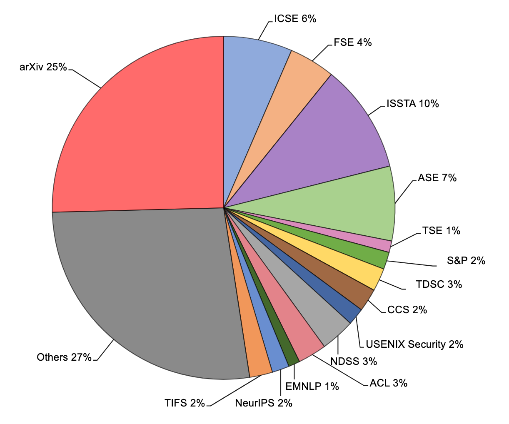
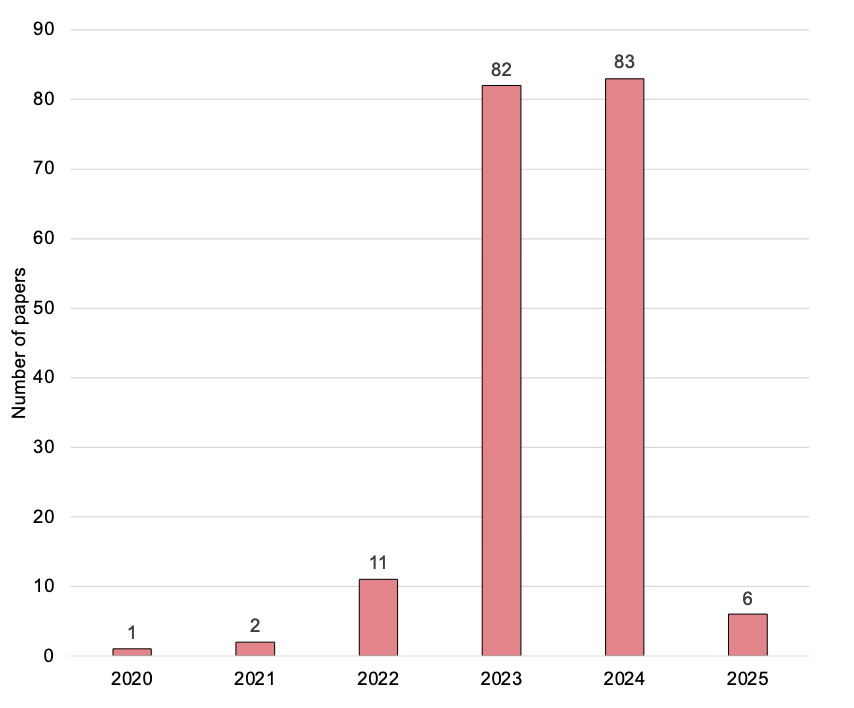
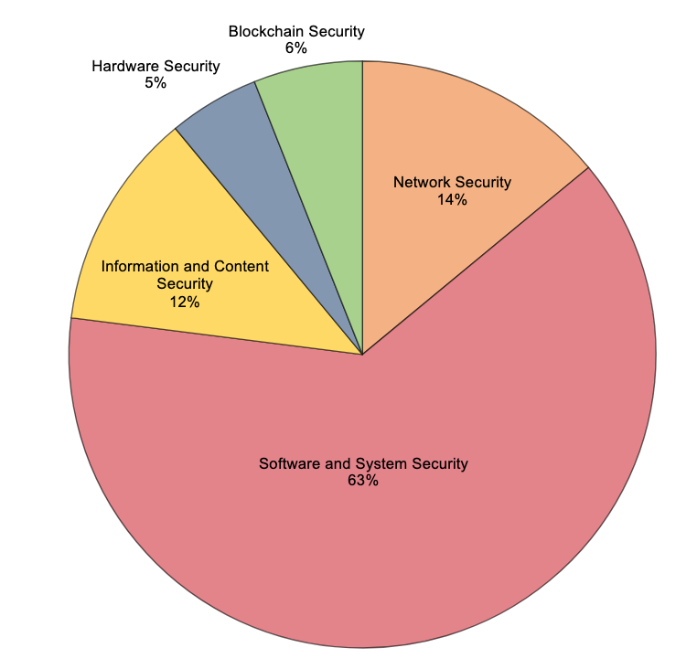
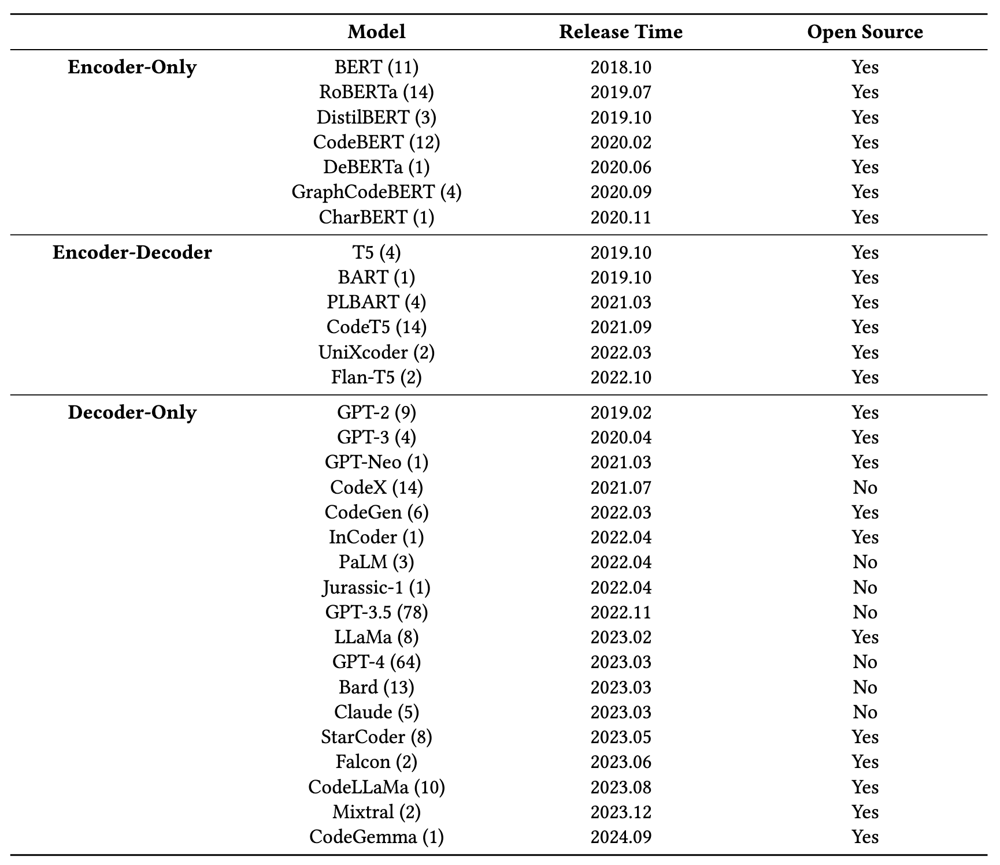
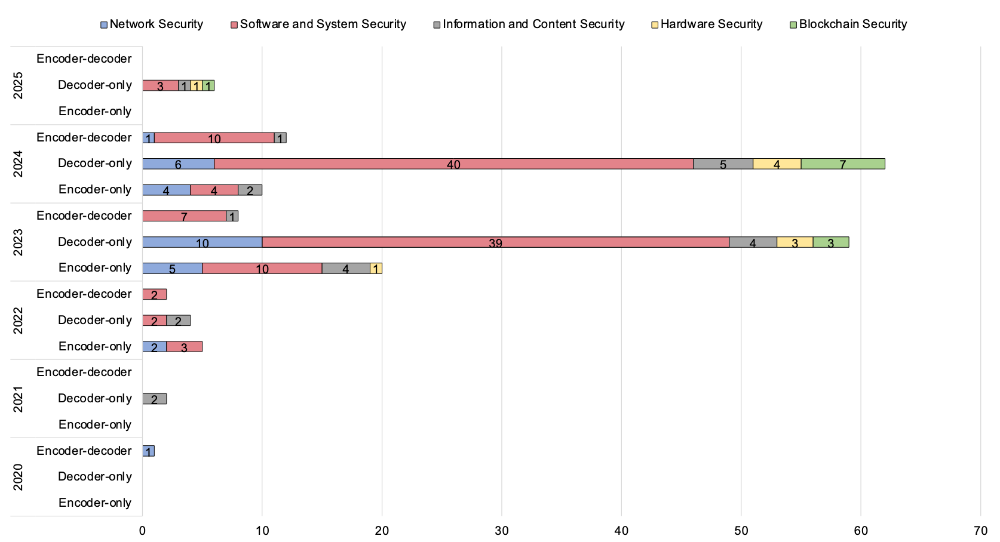

## **Large Language Models for Cyber Security: A Systematic Literature Review**

HANXIANG XU, SHENAO WANG, NINGKE LI, KAILONG WANG, YANJIE ZHAO, KAI CHEN, TING YU, YANG LIU, HAOYU WANG

Huazhong University of Science and Technology, China

https://arxiv.org/abs/2405.04760

  
    按 Enter 继续 <carbon:arrow-right class="inline"/>
  

---
layout: default
---

### **摘要**

大型语言模型（LLMs）的飞速发展为网络安全领域带来了新的机遇。随着网络威胁数量和复杂性的持续增长，对能够自动检测漏洞、分析恶意软件并响应攻击的智能系统的需求日益增加。

本文对LLMs在网络安全中的应用（LLM4Security）进行了全面的文献回顾。通过收集超过4万篇相关论文，并系统分析了来自顶级安全和软件工程会议的185篇论文，旨在提供一个关于LLMs如何解决网络安全领域各种问题的整体视角。

**主要发现**:
* LLMs正被应用于更广泛的网络安全任务。
* 分析了不同LLM架构（如Encoder-only, Encoder-decoder, Decoder-only）的应用趋势。
* 识别了将LLMs应用于特定网络安全领域的先进技术。
* 用于训练和评估LLMs的数据集在规模和多样性上通常有限。
* 讨论了未来研究的主要挑战和机遇。

**核心贡献**:
* 对LLM4Security的最新研究进行了全面的系统性文献综述。
* 筛选了185篇高质量论文进行详细审查。
* 提出了四个关键研究问题，从模型类型、安全任务、领域特定技术和数据处理等多个维度进行分析。
* 分析了所选论文在不同会议和年份的分布，并对主流LLMs的特性进行了分类。

<!-- ---

### **引言：LLM 与网络安全**

* **LLM的崛起**: 自然语言处理（NLP）的进步主要由LLMs驱动，它们基于Transformer架构，并在海量文本数据上训练（如BERT, GPT-3,4, PaLM, Claude）。·
* **LLM的强大能力**: 这些基础模型学习了丰富的语言表示，能以最少的微调适应下游应用，在问答、对话系统、程序综合等领域取得突破。
* **网络安全的迫切需求**: 面对日益增长和复杂的网络威胁，迫切需要智能系统来自动检测漏洞、分析恶意软件和响应攻击。
* **LLM4Security**: 近期研究探索了LLMs在广泛网络安全任务中的应用。
    * **软件安全**: 漏洞检测、安全相关代码生成（补丁、漏洞利用）。
    * **高层安全制品分析**: 理解安全策略、隐私政策，检测违规。
    * **网络安全**: 检测和分类网络攻击（DDoS、端口扫描、僵尸网络）。
    * **恶意软件分析**: 基于文本报告和行为描述分类恶意软件家族，检测恶意域名和URL。
    * **社会工程**: 通过分析邮件内容检测和防御钓鱼攻击。
    * **增强系统鲁棒性**: 生成对抗样本测试安全分类器，模拟攻击场景。

LLMs通过处理大量非结构化文本、从海量数据中学习模式以及为测试和训练生成相关示例，展现出提高网络安全实践效率和有效性的巨大潜力。 -->

---

### **相关工作与本文贡献**

**现有综述的局限性**:

现有综述通常范围较窄，主要关注LLMs可应用的任务类型，而缺乏对数据、领域特定技术等其他关键方面的广泛分析。

**本综述的独特性与贡献**:
* **系统性和广泛性**: 通过系统收集47,135篇相关论文，并深入分析185篇顶级会议论文，提供LLM4Security的整体视图。
* **多维度分析**: 不仅识别任务类型，还审查了具体的数据集、预处理技术和领域适应方法。
* **研究问题 (RQs)**:
    1.  **RQ1**: LLM辅助了哪些类型的安全任务？
    2.  **RQ2**: 哪些LLMs被用于支持安全任务？
    3.  **RQ3**: 使用了哪些领域特定技术来使LLMs适应安全任务？
    4.  **RQ4**: 在将LLMs应用于不同安全任务时，数据收集和预处理有何差异？

<!-- ---

### **系统性文献综述 (SLR) 方法论**

本研究采用SLR方法调查LLM4Security的最新研究进展，旨在全面描绘该领域的技术图景。
遵循既定的SLR指南，我们的方法论分为三个关键阶段：

**1. 规划 (Planning)**
* **识别需求**: 明确SLR的必要性。
* **制定研究问题 (RQs)**: 精确定义研究问题，以理解LLMs在安全任务中的应用、益处和挑战。
* **定义SLR协议**: 制定详细的搜索策略，包括特定会议、数据库、关键词和质量评估标准。
* **识别纳入/排除标准**: 共同审查协议以增强其稳健性。

**2. 执行 (Conducting)**
* **文献检索**:
    * **识别相关会议和数据库**
    * **人工搜索建立QGS (Quasi-Gold Standard)**
    * **识别搜索关键词**
    * **自动化搜索**
* **研究筛选**:
    * **论文质量评估**: 初步基于标题摘要筛选，再全文审查。
    * **滚雪球法**
    * **去重、数据提取**。

**3. 报告 (Reporting)**
* **结果呈现**: 结构化叙述，辅以图表等视觉工具。
* **讨论与展望**: 讨论研究结果的意义，LLMs革新网络安全实践的潜力，并识别未来研究方向。

 -->

---

### **研究问题 (RQs) 详解**

**RQ1: LLM辅助了哪些类型的安全任务？**
* **关注点**: LLMs已应用的安全任务的范围和性质。
* **目标**: 分类并理解LLMs正用于解决的安全挑战的广度，突出模型在各种安全维度上的适应性和有效性。
* **方法**: 根据不同安全领域对先前研究进行分类，并详细介绍各领域中使用LLMs的各种安全任务。

**RQ2: 哪些LLMs被用于支持安全任务？**
* **关注点**: 已在安全任务中使用的具体LLMs清单。
* **目标**: 理解所用LLMs的多样性和特性，为它们在不同安全应用中的多功能性和适用性提供见解。
* **方法**: 讨论LLMs的架构差异，并分析不同架构的LLMs在不同时期对网络安全研究的影响。

**RQ3: 使用了哪些特定技术来使LLMs适应安全任务？**
* **关注点**: 用于微调或调整LLMs以适应安全任务的具体方法和技术。
* **目标**: 理解这些技术，为增强LLMs在专门任务中有效性的定制过程提供有价值的见解。
* **方法**: 通过分析论文中采用的领域特定技术，揭示这些技术与特定安全任务之间的内在和特定联系。

**RQ4: 数据收集和预处理有何差异？**
* **关注点**: LLMs与特定任务所用数据之间相关性。
* **目标**: 从数据收集和数据预处理两个维度揭示在安全任务中应用LLMs时因数据产生的挑战。
* **方法**: 总结数据、安全任务和LLMs之间的内在关系。

---

### **什么是"Quasi-Gold Standard (QGS)"**

现在要写一篇关于"中国最好吃的火锅店"的综合报告：

1. 建立"准黄金标准"
    * 先去几个知名美食街（相当于顶级学术会议）
    * 手动走访，找到10家公认的好火锅店，这10家店就是你的"准黄金标准"
2. 分析关键词
    * 看这10家店的招牌、简介，发现它们都有这些词：
    * "麻辣"、"正宗"、"川味"、"老字号"、"手工"
3. 用关键词大范围搜索
    * 在各大点评网站用这些词搜索
    * 搜出几万家店
4. 验证搜索效果
    * 检查：你的搜索是否找到了最初那10家好店？
    * 如果10家店中只找到了7家，说明搜索不够好，需要调整关键词

---

### **搜索策略**

采用 "Quasi-Gold Standard" (QGS) 策略。
1.  **识别相关会议和数据库**:
    * 安全会议 (S&P, NDSS, USENIX Security, CCS), 期刊 (TDSC, TIFS)。
    * 软件工程会议 (ICSE, ESEC/FSE, ISSTA, ASE), 期刊 (TOSEM, TSE)。
    * **arXiv** (因LLM新兴特性)。
    * 数据库: ACM Digital Library, IEEE Xplore, Science Direct, Web of Science, Springer, Wiley, arXiv。
2.  **建立QGS**: 手动筛选118篇LLM4Sec相关论文。
3.  **定义搜索关键词**: 基于QGS论文标题摘要进行词频分析。
    * LLM相关: Large Language Model, LLM, GPT, ChatGPT, T5, Llama等。
    * 安全任务相关: Cyber Security, Vulnerability Detection, Malware Analysis, Phishing等。
4.  **自动化搜索**: 关键词两两配对，在7大数据库搜索2019年后论文，共47,017篇 (加QGS共47,135篇)。

---

### **研究筛选**

初始池: 47,135篇论文。
1.  **粗粒度纳入/排除**:
    * In#1 (标题摘要含关键词): 剩10,302篇。
    * Ex#1 (去重): 减797篇。
    * Ex#2 (排除短文/非研究型): 减6,507篇。
    * Ex#3 (排除非指定会议/期刊/arXiv预印本): 剩622篇。
    * In#2~4, Ex#4~8 (手动检查主题相关性): 剩236篇。
2.  **细粒度质量评估**: 5个QAC标准，3分制，总分≥6通过，剩151篇。
3.  **前向/后向滚雪球**: 对151篇论文进行滚雪球，获得1,072+2,927篇，经筛选评估后新增34篇。
4.  **最终选定**: 185篇论文。

**什么是学术研究中的Forward and Backward Snowballing？**

* 前向滚雪球: 搜索引用了这151篇论文的论文。
* 后向滚雪球: 查看这151篇论文引用的论文。

---

### **所选论文统计**

总共获得 **185篇** 相关研究论文。

发表途径:

<!-- * **arXiv**: 25% (反映LLM4Security研究新兴快速的特点)。
* **同行评审及其他**: 75%。
* **高频会议/期刊**:
    * ISSTA: 10%
    * ICSE: 8%
    * ASE: 7%
    * 其他: FSE (4%), NDSS (3%), ACL (3%), TDSC (3%), S&P (2%), CCS (2%), USENIX Security (2%), TIFS (2%), NeurIPS (2%), EMNLP (1%), TSE (1%)。 -->

论文发表年份分布:

<!-- * **2020年**: 1篇
* **2021年**: 2篇
* **2022年**: 11篇
* **2023年**: 82篇 (爆炸性增长)
* **2024年**: 83篇 (持续高峰)
* **2025年 (早期)**: 6篇
* 增长趋势表明对LLM4Security研究的兴趣日益增加。 -->

---

### **RQ1: LLM辅助的安全任务概览**

本节探讨LLM在不同安全领域的应用。我们将它们分为六个主要领域，共185篇论文。

* **软件和系统安全 (Software and System Security)**: **63%**
    * 重点是利用LLM自动化处理程序和系统中的潜在安全问题。
* **网络安全 (Network Security)**: **14%**
    * LLM辅助流量检测和网络威胁分析。
* **信息和内容安全 (Information and Content Security)**: **12%**
    * 使用LLM生成和检测虚假内容。
* **硬件安全 (Hardware Security)**: **5%**
* **区块链安全 (Blockchain Security)**: **6%**
    * 在使用LLM分析硬件级漏洞和区块链技术中的潜在安全风险方面具备研究潜力。

<!-- **表4: 六大安全领域的安全任务分布 (部分)** 
* **网络安全 (26篇)**: Web Fuzzing (3), 流量与入侵检测 (10), 网络威胁分析 (5), 渗透测试 (4), 协议分析 (1), 协议Fuzzing (2), Web漏洞检测 (1)。
* **软件和系统安全 (119篇)**: 漏洞检测 (22), 漏洞修复 (15), Bug检测 (11), Bug修复 (32), 程序Fuzzing (11), 逆向工程与二进制分析 (10), 恶意软件检测 (3), 系统日志分析 (10), 安全代码生成 (2), ADS安全验证 (2), 代码混淆 (1)。
* **信息和内容安全 (20篇)**: 钓鱼与诈骗检测 (8), 有害内容检测 (8), 隐写术 (2), 访问控制 (1), 取证 (1)。
* **硬件安全 (9篇)**: 硬件漏洞检测 (2), 硬件漏洞修复 (5), 硬件IP保护 (1), 安全断言生成 (1)。
* **区块链安全 (11篇)**: 智能合约漏洞检测 (10), 交易异常检测 (1)。 -->

---

### **网络安全中的LLM应用**

**Web Fuzzing**

**什么是Fuzzing?**

Fuzzing = 故意给程序"喂"异常输入，看它会不会"消化不良"

* 生成测试用例以发现Web应用漏洞。
* GPTFuzzer (Decoder-only) 生成针对SQL注入、XSS、RCE的有效载荷。通过强化学习微调和KL散度惩罚生成攻击载荷。
* Encoder-decoder模型生成SQL注入检测测试用例。
* CHATAFL 为缺乏机器可读版本的网络协议生成结构化测试输入。

**流量与入侵检测**
* 广泛应用于传统Web应用、IoT、车载网络场景。
* LLMs学习恶意流量数据特征，捕获用户行为异常，描述入侵意图，并提供安全建议。
* 通过提取恶意URL的层次特征检测恶意URL行为。

**网络威胁分析 (CTI)**
* CTI生成: 从网络安全文本（书籍、博客）中提取CTI，从非结构化信息生成结构化CTI报告，从网络安全实体图生成CTI。
* CVEDrill 生成潜在网络安全威胁的优先级建议报告并预测其影响。
* ChatGPT 辅助或自动化对威胁行为的响应决策。

---

### **网络安全中的LLM应用**

**渗透测试**

**什么是渗透测试？**

扮演黑客攻击自己的系统，提前发现安全漏洞

* LLMs收集渗透测试信息（IP、域名、SSL/TLS凭证等）。
* ChatGPT能生成更具针对性和复杂性的恶意载荷。
* LLMs开发自动化Linux提权指导工具。

**协议分析**
* 分析复杂网络协议规范以检测不一致性。
* CellularLint (领域自适应LLM + 少样本/主动学习) 识别4G/5G蜂窝标准中的行为不一致性，这些不一致性可能影响网络实现的安全性和互操作性。

**协议Fuzzing**
* 指导协议Fuzzing，尤其针对仅以自然语言指定的协议。
* ChatAFL 将LLM集成到Fuzzing循环中，生成有效测试输入指导基于突变的Fuzzer (如AFL++)。
* LLMIF 增强LLM与协议规范，自动提取消息格式、字段约束和状态转换规则，针对IoT协议。

**Web漏洞检测**
* 用于检测Web应用漏洞，但存在语言特性和数据可用性挑战。
* RealVul 集成深度程序分析技术（控制流/数据流分析）以增强LLM检测PHP漏洞的性能。

---

### **软件与系统安全中的LLM应用**

**漏洞检测与修复**

LLM在静态漏洞检测方面显著优于传统方法，能够生成结构化代码表示并进行多任务学习。在漏洞修复中，T5等编码器-解码器架构表现较好，但需要解决功能正确性和编程语言差异等挑战。

**Bug检测与修复**

LLM通过代码比较和静态分析结合实现精确Bug定位，对比学习技术帮助识别代码差异。在修复方面，多种LLM能生成语法正确的代码，结合交互式反馈和特定数据集微调可显著提升修复质量。

**程序模糊测试**

LLM的生成能力克服了传统模糊测试局限，能从历史Bug报告生成测试用例，分析程序文档预测高风险组合，并通过强化学习优化测试策略，特别适用于复杂输入处理。

**逆向工程与二进制分析**

LLM在逆向工程中能够恢复变量名、反汇编可执行文件、分析二进制字节码，并保留代码语义对称性。还可用于软件作者身份分析和APT恶意软件组织级验证，增强反编译器输出可读性。

**其他安全应用**

LLM在恶意软件检测中提取语义特征并增强检测数据集；在系统日志分析中识别异常模式；在安全代码生成中通过优化提示减少不安全代码；在自动驾驶安全验证中生成测试场景并诊断违规原因。

---

### **信息与内容安全中的LLM应用**

**钓鱼与诈骗检测 (Phishing and Scam Detection)**
* LLMs用于自动化钓鱼邮件生成。同时LLMs可以针对特定邮件特征的微调实现钓鱼邮件检测。LLMs在垃圾邮件检测中效果显著优于传统机器学习方法。
* LLMs可自动与诈骗者进行无意义交互，浪费其时间资源。

**有害内容检测 (Harmful Contents Detection)**

检测极端政治立场，追踪犯罪活动言论，识别社交媒体机器人，辅助人工审核员评估内容。

**访问控制 (Access Control)**

* PassGPT (LLM密码生成模型)引入引导式密码生成，遵守用户定义约束。优于GANs，能生成更多未见密码。

**隐写术 (Steganography)**

隐写术 = 把秘密信息藏在看起来无害的载体中

与加密的区别：加密是别人知道你在传秘密，但不知道内容, 隐写术是别人根本不知道你在传秘密

* GPT-2模型将密文编码为自然语言覆盖文本，用于在公共平台隐蔽传输信息。

**取证 (Forensics)**
* 数字取证在起诉网络犯罪中起关键作用。证据需法庭采纳。
* LLMs在数字取证场景（文件识别、证据检索、事件响应）中具备潜力。
* 结论：LLMs目前尚不能作为独立数字取证工具，但在某些情况下可作为辅助工具。

---

### **硬件安全中的LLM应用**

* **硬件漏洞检测**:
    * LLMs从硬件开发文档中提取安全属性。HS-BERT在OpenTitan SoC设计中识别8个安全漏洞。
    * LLMs从用户定义SoC规范中识别安全漏洞，映射到CWE，生成断言并执行安全策略。
* **硬件漏洞修复**:
    * LLMs在SoC安全验证中显示潜力，用于漏洞插入、安全评估、验证和缓解策略开发。
    * LLMs提供漏洞修复策略建议，提高硬件漏洞分析和缓解效率。
    * LLMs可生成硬件级安全漏洞，也可用于生成安全硬件代码 (如针对10个硬件设计级CWEs)。
    * 基于硬件安全漏洞语料库评估LLM自动化修复性能。
    * 有效的提示工程 + 功能/形式验证可成功修复HDL代码中的安全bug。
* **硬件IP保护**:
    * LLMPirate探索LLM如何被用于硬件IP盗版，通过语法翻译和交互反馈重写硬件网表以规避检测工具。
* **安全断言生成**:
    * LLM自动化生成SVA (SystemVerilog Assertions)。LLM可生成语法正确的断言，但功能正确性和相关性高度依赖提示上下文质量。

---

### **区块链安全中的LLM应用**

**区块链安全中的LLM应用**
* **智能合约漏洞检测**:
    * 智能合约是区块链应用核心，但开发中可能引入漏洞导致财务损失。
    * LLMs自动化检测智能合约漏洞，但结果常有高误报率，需仔细考虑形式属性。性能因漏洞类型和LLM上下文长度而异。
    * GPTLENS分两阶段检测：生成多样化漏洞响应，然后评估和排序以减少误报。
    * LLM + 程序分析识别逻辑漏洞，LLM匹配潜在漏洞，静态确认验证结果。
    * SOChecker: LLM先完成Stack Overflow中不安全代码片段，再在完整代码上下文中识别漏洞。
    * LLM检测复杂语义漏洞（如庞氏骗局、会计错误）。
    * LLM生成对抗性合约验证可利用性，或结合GNN和链上分析检测已部署恶意合约。
* **交易异常检测**:
    * 传统方法（基于奖励或模式）难以实时检测所有区块链交易异常。
    * LLMs可动态实时检测区块链交易异常，因其搜索空间不受限且不依赖预定义规则/模式，能检测更广泛异常。

---

### **RQ2: LLM架构及其在网络安全中的应用**

本研究采用Panet等人 的分类框架，将主要LLMs分为三类架构：**Encoder-only, Encoder-decoder, Decoder-only**。同时考虑模型是否开源。

当前市面的商用主流LLM:

* OpenAI系列：GPT-o3, GPT-o4mini
* Claude系列：Claude-4.0-sonnet, Claude-3.7-sonnet
* Google系列：Gemini-2.5-pro, Gemini-2.5-flash
* 国产系列：DeepSeek-R1, DeepSeek-V3, 豆包

---

### **RQ3: LLM领域特定技术概述**

LLMs在各种智能任务中已证明其有效性。模型通常先在大型无标签语料库上预训练，然后针对下游任务进行微调。然而，预训练和下游任务输入格式的差异给有效利用LLMs编码知识带来挑战。

用于安全任务的LLM技术可大致分为三类：

**提示工程 (Prompt Engineering)**

通过精心设计的提示词来引导LLM完成特定安全任务，无需修改模型参数。包括零样本学习、少样本学习和思维链推理等策略。这种方法能够直接利用预训练模型的知识，快速适应各种安全场景，是最直接且成本最低的LLM应用方式。

**微调 (Fine-tuning)**

在预训练LLM基础上，使用特定安全任务的数据集进一步训练模型参数，使其更好地适应安全领域。包括全参数微调、参数高效微调(PEFT)和强化学习等策略。虽然需要额外的计算资源，但能显著提升模型在特定安全任务上的性能表现。

**外部增强 (External Augmentation)**

通过集成外部工具、知识库或其他模型来增强LLM的安全任务处理能力。包括检索增强生成(RAG)、工具调用、多模型协作等技术。这种方法能够弥补LLM在领域知识、实时信息和专业工具方面的不足，提供更全面可靠的安全解决方案。

---

### **提示LLMs以适应安全任务**

提示工程 (Prompt Engineering) 是一种新兴的微调方法，旨在弥合LLM预训练时期望输出与下游任务之间的差距。精心设计的提示作为特征，已成为与ChatGPT、Bard等LLM交互的基础技术。

* **对数据特征有限的安全任务尤其有益**: 当常规数据集（网络威胁报告、社交媒体有害内容、代码漏洞数据集等）受限或细节不足时，提示工程至关重要。
* **应用示例**:
    * **网络威胁分析**: 构建包含当前网络安全态势的提示，使LLM以零样本学习方式直接从流特征中学习，从非结构化数据中提取结构化网络威胁情报。
    * **程序Fuzzing**: 将多个独立测试用例集成到提示中，辅助LLM学习测试用例特征并通过少样本学习 生成新测试用例。
    * **渗透测试** 和 **硬件漏洞验证**: 涉及多步骤和严格逻辑推理的任务，可利用思维链 (CoT) 指导提示定制，辅助LLM进行过程推理并自主分步完成任务。
* **普遍性**: 在LLM4Security中，几乎所有安全任务都涉及提示工程，突显了提示的不可或缺作用。

结论：提示工程在增强LLM针对特定安全任务的性能方面起着关键作用，有助于开发自动化安全任务解决方案。

---

### **微调 LLMs 以适应安全任务**

微调是调整预训练LLM以适应特定领域（如网络安全）的关键步骤，因为初始训练可能未充分覆盖专业领域的细微差别。此过程涉及在任务相关数据集上进一步训练模型以调整其参数。
* **普遍性**: 在调研的185篇论文中，57项研究 (31%) 采用了微调。
* **领域差异**: 信息内容安全 (50%) 和软件系统安全 (36%) 中最普遍，网络安全 (15%) 中度使用，硬件/区块链安全中未见。
* **主要动机**: 赋予通用LLM领域特定知识和能力。
    * **软件漏洞管理**: RealVul微调CodeBERT/CodeT5改进PHP漏洞分类。VulLLM多任务指令微调CodeBERT/CodeT5进行漏洞检测、定位和解释。T5等模型微调用于漏洞修复。VulAdvisor微调CodeT5生成自然语言修复建议。
    * **信息安全**: EXPLAINHM微调Flan-T5分类有害模因。
    * **异常检测**: 适应网络流量 或系统日志 数据。

---

### **微调 LLMs 以适应安全任务**

* **微调策略**:
    * **全参数微调 (Full fine-tuning)**: 调整LLM所有参数，适应性强但计算资源需求大。常用于Bug与漏洞修复。
    * **参数高效微调 (PEFT)**: 更新小子集参数或添加可训练适配器，显著降低成本。LLM4Security中观察到的PEFT技术包括：Adapter-tuning, Prompt-tuning, LoRA, API基础微调 (针对闭源模型)。
* **基于强化学习(RL)的策略**: 基于强化学习的微调通过设计任务相关的奖励函数（如模糊测试中的绕过成功率、程序修复中的测试通过率），让LLM根据输出结果的反馈不断调整生成策略，从而学会产生更有效的安全任务解决方案。使LLM更符合特定安全目标。
* **挑战**:
    * 高质量、大规模、代表性标记数据集稀缺。
    * 计算资源需求（尤其全参数微调）。
    * 过拟合风险，泛化能力受损。
    * 灾难性遗忘（丢失预训练能力）。
    * 可能损害预训练中的安全对齐，导致生成不安全代码或有害内容。

---

### **外部增强**

尽管LLMs在广泛数据集上进行了彻底的预训练，但由于领域数据的多样性、领域专业知识的复杂性以及领域目标的特殊性，直接将其用于解决安全领域的复杂任务仍面临诸多挑战 。LLM4Security中的一些研究引入了外部增强方法，以增强LLM在解决安全问题中的应用。这些技术促进与LLM的更好交互，弥补其知识库差距，并最大化其基于现有知识产生可靠输出的能力。

1.  **特征增强 (Features Augmentation)**: 将数据集中隐式存在的任务相关特征（如漏洞描述、bug位置、威胁流图）融入提示。
2.  **外部检索 (External Retrieval)**: 外部知识库可减轻LLM因缺乏领域专业知识而产生的幻觉或错误。LLM与外部知识库交互检索相关知识。
3.  **外部工具 (External Tools)**: 基于规则的外部工具可作为专业知识库，LLM利用其结果纠正输出。
4.  **任务自适应训练 (Task-adaptive Training)**: 采用对比学习或蒸馏等训练策略，增强LLM对复杂安全任务的适应性。
5.  **模型间交互 (Inter-model Interaction)**: 分解流程，引入多个LLM（或其他模型如GNN）协作以增强性能。
6.  **重广播 (Rebroadcasting)**: 针对需多次交互的任务，将每步输出迭代作为下一步提示的一部分，强化上下文关系。
7.  **后处理 (Post-process)**: 对LLM输出进行验证或处理以匹配特定任务需求（如基于编辑距离缓解幻觉，对生成代码进行形式验证），减轻因缺乏领域知识导致的幻觉等问题。
8.  **工作流集成 (Workflow Integration)**: 将LLM作为组件集成到特定任务工作流中，并结合各种形式的交互反馈（如覆盖率指导Fuzzing策略，自检推理步骤，LLM输出集成到人工评分系统）。

外部增强技术显著提升了LLM在各种安全任务中的有效性，是解决LLM领域知识缺陷和任务对齐问题的有潜力途径。

---

### **RQ4: 数据收集与预处理概述**

数据在模型训练过程中起着至关重要的作用。首先，收集多样化和丰富的数据对于模型有效处理广泛场景和上下文至关重要。其次，数据分类有助于明确模型训练目标，避免歧义和误解。此外，数据预处理对于清洗和优化数据，从而提高其质量至关重要。

---

### **数据收集**

数据对LLM训练不可或缺，影响模型的泛化能力、有效性和性能。

**数据来源分类**:
1.  **开源数据集 (Open-source datasets)**: 公开可访问，通过开源平台或在线存储库分发。常用于模型基准测试或既定任务微调。
2.  **收集的数据集 (Collected datasets)**: 研究人员直接从各种来源（如网站、论坛、社交媒体）收集。通常为特定研究问题量身定制。
3.  **构建的数据集 (Constructed datasets)**: 研究人员通过修改或增强现有数据集以更好地适应其特定研究目标而创建。可能包括手动或半自动创建特定领域测试集、标注数据集或生成合成数据。
4.  **工业数据集 (Industrial datasets)**: 从真实商业或工业环境获取的数据。对旨在真实部署的模型训练和评估尤为宝贵。

---

### **数据集类型**

数据类型的选择对LLM的架构和选择至关重要，直接影响特征提取和模型决策。
我们将所有数据集分为三类：**代码型 (Code-based)，文本型 (Text-based)，和组合型 (Combined)**。

**代码型数据集 (90例)**
* 强调LLM固有的代码分析能力。
* 适用于漏洞检测、程序Fuzzing、Bug修复等任务的微调。
* **主要类型**:
    * 易受攻击代码: 24例
    * 源代码: 23例
    * Bug-修复对: 16例
    * 错误代码: 10例
    * 流量包: 4例

**文本型数据集 (60例)**
* 涵盖与网络安全相关的各种文本信息。
* **主要类型**:
    * 提示: 19例
    * 日志消息: 8例
    * 社交媒体内容: 7例
    * 垃圾邮件消息: 4例
    * Bug报告: 4例
    * CVE报告: 2例
    * 提交信息: 2例

**组合型数据集 (23例)**
* 一种日益增长的方法，通常将代码构件与相关自然语言文本配对。
* **示例**:
    * 易受攻击代码 + 漏洞描述
    * 错误代码 + Bug报告
    * 源代码 + 程序文档
* **优势**: 利用LLM同时处理结构化代码和非结构化文本的能力。提供自然语言上下文有助于LLM实现更深层次的代码语义理解。

---

### **数据预处理**

训练和使用LLM时，需预处理初始数据集以获得干净、合适的数据。不同数据类型可能需要不同预处理方法。

**代码型数据集的预处理技术**
1.  **数据提取**: 从不同来源检索相关代码片段（行、方法、文件等）。
2.  **重复实例删除**: 识别并消除重复项，增强多样性和唯一性。
3.  **不合格数据删除**: 移除不符合预定义质量标准（大小、复杂性、明显提示）的片段，避免噪声。
4.  **代码表示**: 将片段转换为适合LLM处理的格式，通常涉及安全任务的词元化。
5.  **数据分割**: 将预处理数据集分为训练集、验证集和测试集。

**文本型数据集的预处理技术**
1.  **数据提取**: 从Bug报告、程序文档、硬件文档、社交媒体内容 等来源仔细检索文本。
2.  **初始数据分割**: 根据研究任务需求将文本分割成句子或单词。
3.  **不合格数据删除**: 标准化和清洗文本，通常包括移除特定符号、停用词和特殊字符，转换大小写。
4.  **文本表示**: 将文本词元化为词或子词等小单元，便于特征学习。
5.  **数据分割**: 将预处理数据集分为训练、验证和测试子集。

---

### **使用LLM进行数据增强**

在网络安全任务中应用LLM的一个常见挑战是缺乏高质量的标记数据。漏洞、恶意软件、特定攻击类型等数据集在数量和多样性上难以充分获取。为解决此瓶颈，许多研究探索利用LLM自身的生成能力进行数据增强。目标是提升数据集大小、多样性和平衡性，从而提高在增强数据上训练（通常通过微调）的安全模型的鲁棒性和泛化性能。

**LLM数据增强策略**:

* **生成合成代码样本**:
    * 创建新的易受攻击代码示例    
    * 生成特定恶意实体：如基于已知种子生成恶意NPM包的多样化合成变体，以改进恶意软件检测训练的微调。
* **辅助构建知识库**:
    * VULTURE使用LLM分析CVE和提交，构建全面的第三方库漏洞数据库，供下游检测工具使用。

* **生成合成文本数据**:
    * 有害在线话语示例。
    * 自然语言修复建议（“oracles”）：用易受攻击代码和补丁提示LLM生成，形成语料库微调建议模型。
    * 简洁漏洞解释：从补丁特征派生，用于多任务微调期间训练辅助任务。
    * 更丰富的文本特征：如EXPLAINHM产生的解释性“辩论文本”，用于微调有害模因分类器。

---

### **挑战**

**LLM适用性挑战**
* **模型大小与部署**:
    * LLM参数量巨大对存储内存计算需求构成挑战。
    * 阻碍LLM部署，尤其在缺乏强大GPU/TPU的资源受限场景和需实时部署时。
* **数据质量、可用性与安全挑战**:
    * LLM高度依赖多样化数据集进行训练和微调。面临数据稀缺挑战。
    * 许多特定安全任务缺乏高质量、鲁棒的公开数据集。
    * 有限或有偏见的数据集可能导致模型继承偏见，产生不准确预测。
    * 基准数据污染风险
    * 训练语料中包含个人隐私信息（电话、邮件）

**LLM泛化能力挑战**
* 指LLM在训练环境之外的多样任务、数据集或领域中持续准确执行任务的能力。
* 尽管LLM经广泛预训练获得广博知识，但缺乏专业知识可能在处理超出预训练范围的任务（尤其网络安全领域）时面临挑战。
* 不同领域和任务规范的代码或文档上下文和语义差异巨大。
* 为确保LLM稳健泛化，需在各种安全任务数据集上进行细致微调、验证和持续反馈循环。否则有模型过拟合风险，限制其在多样真实场景中的效用。

---

### **挑战**

**LLM可解释性、可信度与道德使用挑战**
* 将LLM集成到安全任务中，确保可解释性和可信度至关重要。
* LLM的“黑箱”特性常阻碍解释其决策过程。LLM自我解释多为事后合理化。
* 提升透明度方法：CoT逐步推理，RAG或引用机制将解释植根于源数据，可视化注意力权重，定义结构化评估标准约束推理，应用XAI方法 (LIME, SHAP)。LLM作“解释翻译器”将XAI输出转为自然语言描述。
* AIGC引入额外安全风险：隐私泄露、伪造信息传播、生成易受攻击代码。
* 面临对抗性攻击威胁，如引导LLM规避安全措施暴露训练数据。

**现代密码分析局限性**
* LLM是概率模型，擅长识别文本模式，与密码分析的确定性、精确性、数学严谨性需求冲突。
* LLM在复杂多步数学计算、形式逻辑推演、抽象概念管理方面能力有限。
* 以数据为中心的学习方法与发现新密码攻击方法的目标不符。
* LLM的幻觉倾向损害其在密码分析应用中的效用。

---

### **机遇**

**改进LLM4Security**
* **安全任务模型训练**:
    * 商业预训练模型 (GPT-4) vs 开源框架 (T5, LLaMa) 的选择。
    * 预训练模型如GPT-4不宜大规模重训练，但能用少量数据快速适应特定任务，减少计算开销。
    * 开源框架如T5提供更广泛定制性，研究者常修改源码并在自有大规模数据集上重训练以满足特定任务需求，但计算资源需求大。
    * 权衡在于：用户友好性/快速部署 vs 广泛任务定制能力/高计算需求。
* **LLM的模型间交互**:
    * 通过外部增强方法进行协作模型交互是一个有前景的方向。
    * 集成多个LLM 或 LLM与专业机器学习模型结合，提高任务效率简化复杂步骤。
* **ChatGPT的影响与应用**:
    * 在分析的185篇论文中，超半数提及ChatGPT。
    * 因计算效率、任务多样性和潜在成本效益受青睐。
    * 促进协作，标志着将高级自然语言理解集成到传统网络安全实践的更广泛努力。

---

### **机遇**

**增强LLM在现有安全任务中的性能**

* **LLM的外部检索与工具**:
    * LLM固有局限性：缺乏领域专业知识，幻觉倾向，数学能力弱，缺乏可解释性。
    * 可行方法：使其与外部世界交互，获取知识以提高生成安全任务解决方案的真实性和合理性。
    * 方案1: 提供外部知识库，通过检索增强内容生成。
    * 方案2: 集成外部专业工具提供实时交互反馈指导LLM。
* **应对特定领域挑战**:
    * 网络安全、硬件安全等领域缺乏开源数据集，阻碍LLM集成。
    * 未来工作重点：开发领域特定数据集，优化LLM以应对这些领域独特挑战。
    * 与领域专家合作收集数据，并用此数据微调LLM，可提高其有效性。

---

### **机遇**

**扩展LLM在更多安全领域的能力**
* **集成新输入格式**:
    * 当前LLM安全任务输入主要为代码和文本。
    * 引入基于自然语言的新格式（语音、图像）及多模态输入（视频演示）可增强LLM理解用户需求的能力。
    * 语音改善交互；图像视觉化任务流程；多模态输入提供更全面上下文理解。
* **扩展LLM应用**:
    * LLM在软件和系统安全领域受关注多。
    * 在硬件安全、区块链安全等领域应用仍有限，某些特定安全任务未被探索。
    * 将LLM扩展到这些欠发达领域是重要机遇，可推动自动化安全解决方案发展。